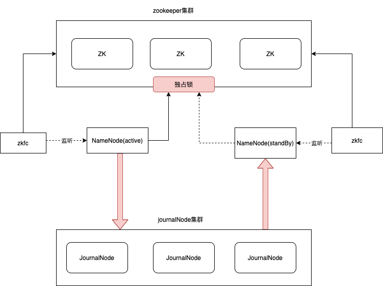

## HDFS架构演进之路

HDFS使用来解决海量数据存储问题，MapReduce使用来解决海量数据如何计算的问题

HDFS全称：Hadoop Distributed File System

### HDFS核心思想

1. 分散存储
2. 冗余存储

### HDFS架构

HDFS是一个主从式的架构，主节点只有一个叫做NameNode。从节点有多个叫DataNode

**NameNode**

1. 管理元数据信息：文件与Block块，Block与DataNode主机的关系
2. NameNode为了快速响应用户的操作请求，会把元数据信息加载到内存里

**DataNode**

1. 存储数据，把上传的数据划分成固定大小的block(HDFS1:64M,HDFS2:128M，可以配置)
2. 为了保证数据安全，每一个数据块默认三份

### 单点故障解决方案

