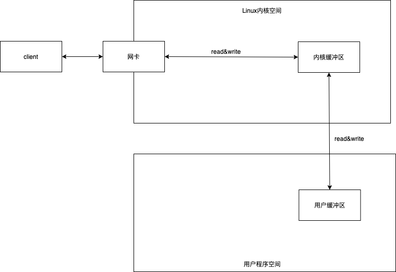
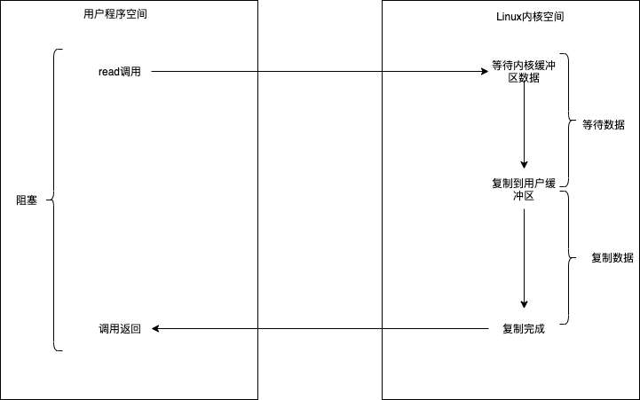
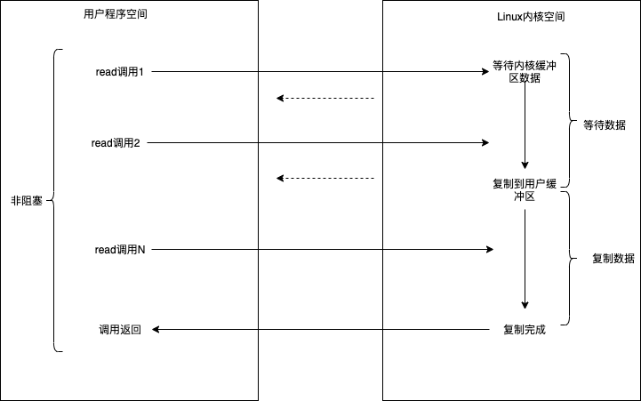
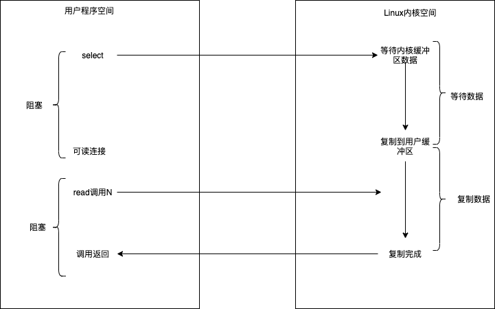
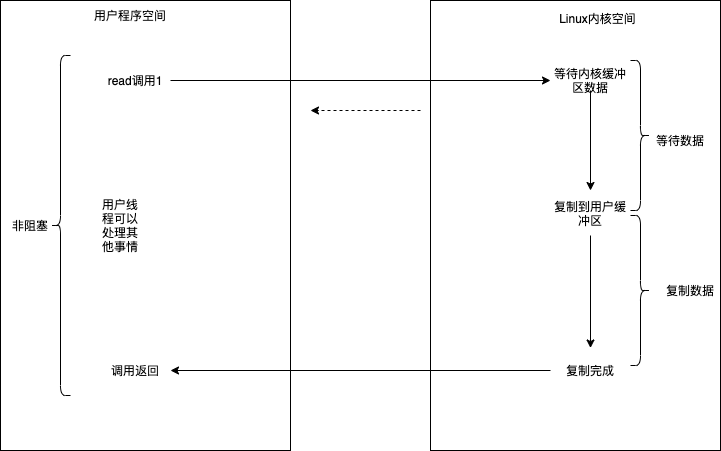

## IO读写的基础原理
    read系统调用，不是直接从物理设备把数据读取到内存中；write系统调用，也不是直接把数据写入到物理设备。两种操作都会涉及到缓冲区。
    即：调用操作系统的read,是把数据从内核缓冲区复制到进程缓冲区；而write系统调用，是把数据从进程缓冲区复制到内核缓冲区

### 内核缓冲区与进程缓冲区

缓冲区：为了减少频繁地与设备之间的物理交换。 
内存缓冲区：上层应用使用read系统调用时，仅仅把数据从内核缓冲区复制到上层应用的缓冲区（进程缓冲区）；在使用write系统调用时，仅仅把数据从进程缓冲区复制到内核缓冲区

### 典型的系统调用流程

在java服务端完成一次socket请求和响应的完整流程如下:

+ 客户端请求：Linux通过网卡读取客户端的请求数据将数据读取到内核缓冲区中
+ 获取请求数据：Java服务器通过read系统调用，从Linux内核缓冲区读取数据，再送入Java进程缓冲区
+ 服务器端业务处理：Java服务器在自己的用户空间中处理客户端的请求
+ 服务器端返回数据：Java服务器完成处理后，构建好的响应数据，将这些数据从用户缓冲区写入内核缓冲区。这里需要用到write系统调用
+ 发送给客户端：Linux内核通过网络IO,将内核缓冲区中的数据写入网卡，网卡通过底层的通信协议，将数据发送给目标客户端

## IO模型

###  同步阻塞IO

阻塞IO：是指需要内核IO操作彻底完成后，才返回到用户空间执行用户的操作。阻塞指的是用户空间程序的执行状态。在Java中，默认创建的socket都是阻塞的

同步IO：是一种用户空间与内核空间的IO发起方式。同步IO指用户空间是主动发起IO请求的一方，内核空间是被动接收方。异步IO：是指系统内核是主动发起IO请求的一方，用户空间的线程是被动接受方

流程图如下：

**阻塞IO的优点：**应用的程序开发简单

**阻塞IO的缺点：** 一个线程维护一个连接的IO操作，在高并发的应用场景下，需要大量的线程来维护大量的网络连接，内存、线程切换开销巨大，因此在高并发场景不适用

### 同步非阻塞IO(non-blocking IO)

非阻塞IO:用户空间的程序不需要等待内核IO操作彻底完成，可以立即返回用户空间执行用户的操作，即处于非阻塞转台，同时内核会立即返回给用户一个状态值

流程如下图：

**优点：**每次发起的IO系统调用，在内核等待数据过程中可以立即返回。用户线程不会阻塞，实时性较好

**缺点:** 不断地轮询内核，大量占用CPU时间，效率低下

不适用于高并发场景，在java的实际开发中，不会涉及该模型

### IO多路复用（IO Multiplexing。JAVA的New IO）

经典的Reactor反应器模式，有时也称为异步阻塞IO，java中的selector选择器和Linux的epoll是这种模型。

在IO多路复用模型中，引入了一种新的系统调用，查询IO的就绪状态。在Linux系统中，对应的系统调用为select/epoll系统调用。    

IO多路复用的模型的流程：

​	1）选择器注册。首先将需要read操作的目标socket网络连接，提前注册到select/epoll选择器中，Java中对应的选择器类是selector类。然后，开启整个IO多路复用模型的轮询流程

   2）就绪状态的轮询。通过选择器的轮询方法，查询注册过的所有socket连接的就绪状态，通过查询的系统调用，内核会返回一个就绪的socket列表。当任何一个注册过的socket中的数据准备好，内核缓冲区有数据，内核就将该socket加入到就绪的列表中。

​	当用户进程调用了select查询方法，整个线程会被阻塞

  3）用户线程获得了就绪状态的列表后，根据其中的socket连接发起read调用，用户线程阻塞。内核开始复制数据，将数据从内核缓冲区复制到用户缓冲区。

  4） 复制完成后，内核返回结果，用户线程才会解除阻塞的状态，用户线程读取到数据后继续执行

流程如下图所示：

​	

​		IO多路复用的特点：该模型设计两种系统调用：一种是select/epoll，一种是IO操作。IO多路复用建立在操作系统 的基础设施上，操作系统的内核支持多路复用。

​		**优点：**使用select/epoll的最大优势在，一个选择器查询线程可以同时处理成千上万个连接。系统不需要建立大量的线程，也不必维护这些线程，从而大大减小了系统的开销

​		**缺点：**select/epoll系统调用仍旧是阻塞的，属于同步IO，整个读写过程依旧是阻塞的。

### 异步IO（Asynchronous IO)

用户空间和内核空间的调用方式反过来。用户空间的线程编程被动接受者，而内核空间成为主动调用者。

