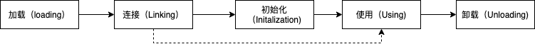
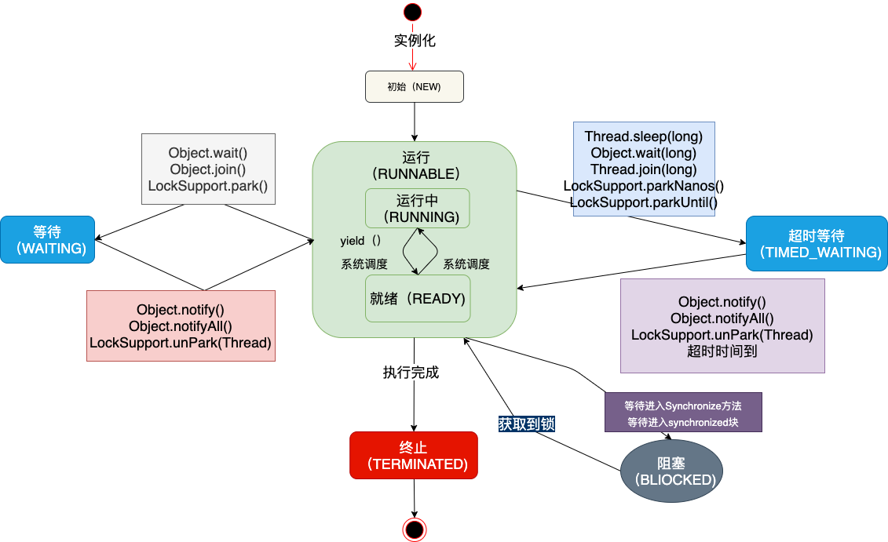

### class的生命周期

class的生命周期分为五个部分：加载、连接、初始化、使用、卸载

#### 加载

​	把类的信息加载到方法区中，并在堆中实例化一个Class对象

##### 加载方式

+ 根据类的全路径加载class文件
+ 从jar包中读取class文件
+ 根据一定的规则实时生成，如设计模式中的动态代理模式，就是根据响应的类自动生成它的代理类

##### 加载的时期

​	不是在jvm启动的时候加载，而是在真实使用的时候去加载

+ new 一个类的时候
+ 调用类的静态方法，以及读取或者修改一个静态字段的时候
+ 该类为程序的入口类
+ 对这个类进行反射的时候

#### 连接

一般和加载阶段和初始化阶段交叉进行

##### 验证

验证该类是否合法

+ 字节码格式是否合法

+ 变量和方法是否有重复

+ 继承和实现是否符合标准

  。。。

##### 准备

给类的静态变量分配并初始化存储空间。即给静态变量赋默认的初始值

##### 解析

把符号引用转化为直接引用，在该阶段jvm会将所有的类或接口名、字段名、方法名转换为具体的内存地址

#### 初始化

执行静态变量的初始化和静态Java代码块，并初始化代码中设置的变量值

##### 时机

和加载的时机一样，初始化之前必须先经过加载

- new 一个类的时候
- 调用类的静态方法,以及读取或者修改一个类的静态字段的时候（不是常量）
- 对这个类进行反射的时候（执行了上面的行为）
- 初始化一个类的子类，该子类所有的父类都会被初始化。
- 作为程序的入口类（如：main方法所在的类，java 命令跟着的类）

##### 过程

按照顺序自上而下运行类中的变量赋值语句和静态语句，如果有父类，则首先按照顺序运行父类中的变量赋值语句和静态语句

#### 使用

使用阶段包括主动引用和被动引用

##### 主动引用

+ new一个类
+ 调用类的静态方法，以及读取或者修改一个类的静态字段的时候
+ 程序的入口类
+ 对类进行反射的时候

##### 被动引用

+ 引用父类的静态字段
+ 定义类数组
+ 引用类的常量

#### 卸载

满足下面的情况会卸载类：

+ java堆中不存在该类的任何实例
+ 加载该类的ClassLoader已经被回收
+ 该类对应的java.lang.Class对象没有任何地方被引用，无法在任何地方通过反射访问该类的方法

### 线程的状态

+ NEW：初始状态，线程被构建，但是还没有调用start()方法
+ RUNNABLE：运行状态，Java线程操作系统中的就绪和运行两种状态笼统地称作运行中
+ BLOCKED：阻塞状态，表示线程阻塞于锁
+ WAITING：等待状态，表示线程进入等待状态，进入该状态表示当前线程需要等待其它线程作出一些特定动作（通知或中断）
+ TIME_WAITING：超时等待状态，该状态不同于WAITING,它是可以在指定的时间自行返回的
+ TERMINATED：终止状态，表示当前线程已经执行完毕

###  