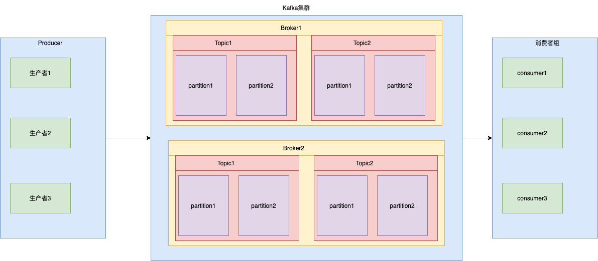
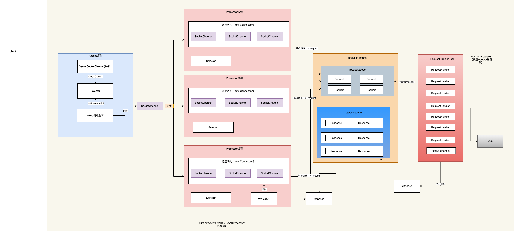

# Kafka

## Kafak核心概念

+ 生产者(Producer) ： 生产数据，并存放在指定的主题中
+ 主题(topic) ：类似于数据库中的表，按主题存储数据
+ 分区(partition) ：一个主题可以按分区存储数据，默认数据只有一个分区，一般为创建topic时指定分区数。在磁盘上体现为目录不同
+ 消费者(consumer)  ： 消费存储在主题中的数据,数据是通过pull的方式，实现消费者消费数据，即消费者自己从topic中拉取
+ 消费者组(consumer group) ： 一组消费者，消费同一的主题
+ Broker： 一个kafka节点称为一个Broker，集群内的BrokerID唯一
+ 副本（replica）：
+ 消息（message）：
+ 偏移量（offset）：

## Kafka高性能

+ 通过顺序写的方式实现kafka高性能的写
+ 通过零拷贝的方式实现Kafka高性能的读

num.network.threads = 9

num.io.threads =  32

+ kafka服务端的设计
  + 服务端如何处理请求
    + 使用NIO
    + 顺序读写
    + 跳表设计
    + 零拷贝
+  Producer设计
  + 批处理
  + 内存池设计
  + 封装同一服务器请求
+ ConsumerGroup设计
  + 同一个消费组是P2P方式，一个消息只能被同一个组的一个消费者消费
  + 不同组时订阅模式，一个消息可以被不同的消费组消费
  + 一个分区同一时间只会被同组一个消费者消费
+ Consumer设计-偏移量存储
  + 0.8以前存储在Zookeeper中，0.8以后存储在Kafka的_consumer_offset的主题中

## Kafka的网络设计

​	 基于NIO的网络设计

​	 消息写入到磁盘之前首先放在一个MessageQueue中，再用多线程处理MessageQueue中

 	有多个Selector设计 	

​	

​	一个Acceptor,负责启动Kafka并监听应用

   三个Processor负责接收请求

​	一个RequestChanel封装RequestQueue负责接收请求

​	一个KafkaRequestHandlerPool监听RequestChannel，当RequestChannle中有数据流入时，该进程负责处理数据，并最中放入磁盘。默认有8个线程进行数据处理

​	RequestChannle还封装三个ReposeChannle负责接收响应

