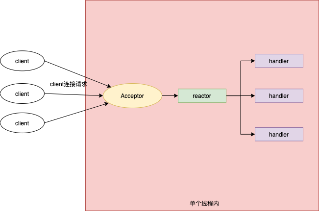

## 简介

​	Reactor反应器模式由Reactor反应器线程，Handlers处理器两个主要角色组成：

1. Reactor反应器：负责查询IO事件，当检测到一个IO事件，就将其发送给对应的Handler处理器去处理。这里的IO事件，就是NIO中选择器监控的通道IO事件
2. Handlers处理器：非阻塞的执行业务处理逻辑。与IO事件（或者选择键）绑定，负责IO事件的处理。完成真正的连接建、通道的读取、处理业务逻辑，负责将结果写出到通道等


## 单线程Reactor反应器模式

### 定义

​	单线程Reactor反应器模式就是，Reactor反应器和Handler处理器在一个线程中执行



参考代码如下：

```java
	package org.spiral.reactor.model;

import java.io.IOException;
import java.nio.channels.SelectionKey;
import java.nio.channels.Selector;
import java.nio.channels.ServerSocketChannel;
import java.util.Set;

/**
 * 单线程Reactor模式实现案例
 * @author : spiral
 * @since : 2021/2/1 - 下午9:21
 */
public class Reactor implements Runnable{

    private Selector selector;

    private ServerSocketChannel serverSocket;

    public Reactor() throws IOException {
        selector = Selector.open();
        serverSocket = ServerSocketChannel.open();

        serverSocket.configureBlocking(false);

        //注册ServerSocket的accept事件
        SelectionKey sk = serverSocket.register(selector, SelectionKey.OP_ACCEPT);

        sk.attach(new AcceptorHandler());
    }

    @Override
    public void run() {
        //选择器轮询
        while (!Thread.interrupted()) {
            try {
                selector.select();
            } catch (IOException e) {
                e.printStackTrace();
            }
            Set<SelectionKey> selected = selector.selectedKeys();
            for (SelectionKey selectionKey : selected) {
                dispatch(selectionKey);
            }
            selected.clear();
        }
    }

    private void dispatch(SelectionKey selectionKey) {
        Runnable handler = (Runnable) selectionKey.attachment();
        if (handler != null) {
            handler.run();

        }
    }

    class AcceptorHandler implements Runnable {
        @Override
        public void run() {
            //接受新连接，为新链接创建一个输入输出的handler处理器
        }
    }
}

```


### 基于Reactor反应器模式的EchoServer

​		EchoServer回显服务器功能：读取客户端的输入，回限到客户端。基于Reactor反应器模式实现，有三个重要的类

1. 反应器类：EchoServerReactor

2. 新连接处理器：AcceptorHandler

3. 回显处理器：EchoHandler

   示例代码如下：

   ```java
   
   ```

   