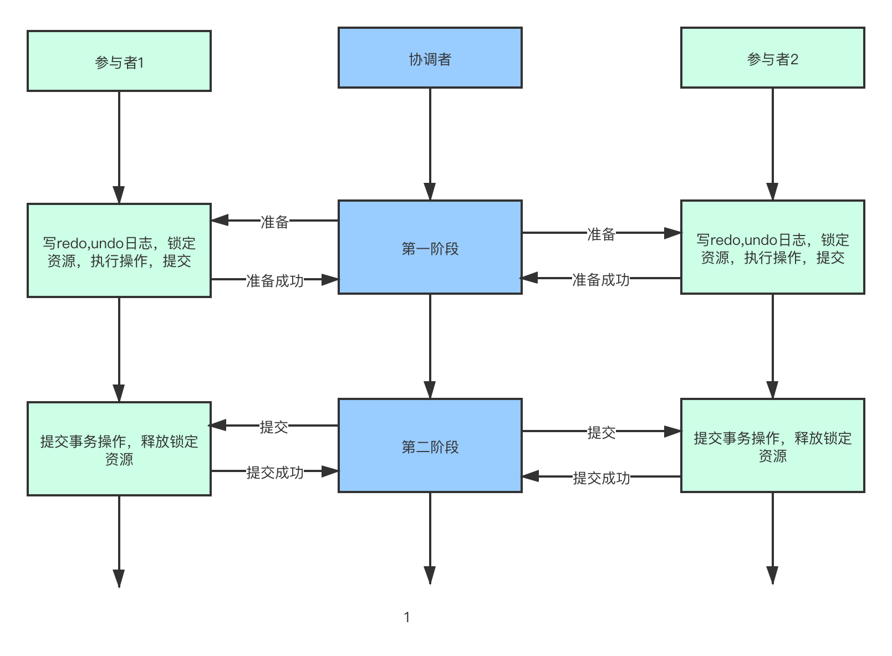
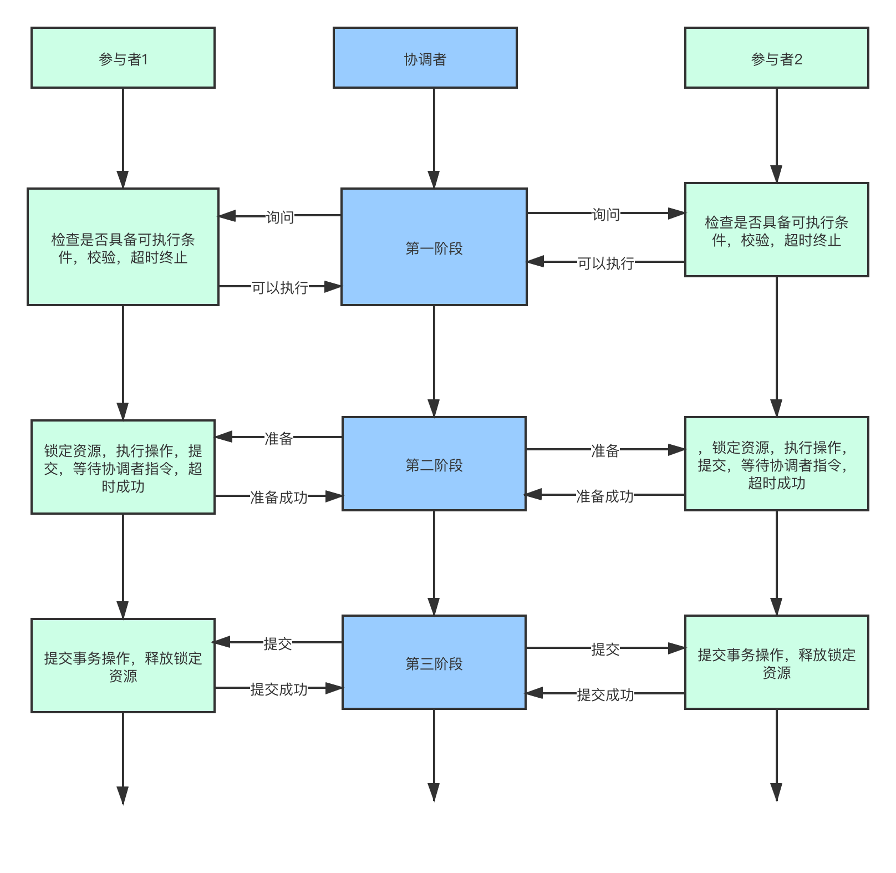

## 分布式系统

​		分布式系统是为了解决单体集中式系统无法解决的问题才产生的。因此了解分布式系统，要先对集中式系统有所了解。集中式系统的发展，以及发展遇到的什么瓶颈，才能清楚为什么要引入分布式系统。


### 集中式系统

​		集中式系统：由一台或多台主计算机组成中心节点，数据集中存储在中心节点，并且整个系统的所有业务单元都集中部署在该中心节点，系统所有的功能均由其集中处理。即：集中式系统中，客户端仅仅负责数据的录入和输出，而数据的存储和控制完全交由主机完成。

​	**优点**

```
1、结构简单：单一系统，单一节点
2、部署简单:只需要在一台机器部署成功即可
3、项目架构简单：所有代码只在一个系统中维护，没有复杂的网络通讯等问题
```

​	

**缺点**

```
1、大型主机的研发人才和维护人才培养成本高
2、大型机价格昂贵
3、单点故障问题，只有一台主机提供服务，一旦出现问题，所有服务终止
4、主机性能拓展受限于摩尔定律，即单一主机纵向拓展时，有性能上线
```


### 分布式系统

​		分布式系统是一个硬件或软件组建在不同的网络计算机上，彼此间仅仅通过消息传递进行通信和协调的系统。即物理上的多台主机组建成一个逻辑上的单台主机。

​		**分布式系统的特点**

```
分布性： 分布式系统中的多台计算机都会在空间上随意分布，同时，它们的分布情况也会随时变动
对等性： 集群中的每个工作节点的角色是一样的。即各个节点互为副本
并发性： 多个机器可能同时操作一个数据库或者存储系统，可能引发数据不一致的问题
缺乏全局时钟：分布式系统中的多个主机上的事件的先后顺序很难界定
故障总是发生（服务器宕机，网络拥堵和延迟）：组成分布式系统的所有计算机，都有可能发生任何形式的故障
```

​		拓展：

```
并行：在多处理器系统中，多个处理器可以同时运行过个线程，这些线程在同一时间可以同时运行。由于存在多个处理器，所以线程之间不会存在抢占CPU资源。简言之,系统具有同时处理多个任务的能力
并发：在单处理器系统中，多个线程在共享CPU时间，操作系统负责调度及分配资源给它们。在操作系统中，是指一个时间段中有几个程序都处于已启动运行到运行完毕之间，且这几个线程都是在同一个处理机上运行，但任一时刻上只有一个程序在处理机上运行。简言之，指系统具有同时处理多个任务的能力。
同步：当进程执行IO(等待外部数据)的时候，线程处于等待状态
异步：当进程执行IO(等待外部数据)的时候，当前线程不处于等待状态
阻塞：当执行IO操作时，等待内核IO操作完成后才返回用户空间程序执行
非阻塞：当执行IO操作时，不等待内核IO操作完成，就从内核操作返回用户空间
```

​	**分布式系统的问题**

	1. 分布式的必要条件之一是网络，因此网络不稳定时，会对性能甚至服务能力造成影响
 	2. 一个集群中的服务器数量越多，服务器宕机的概率越大
 	3. 由于服务在集群中分布式部署，很容易产生数据一致性问题


### **分布式系统常见异常问题**

1. **通信异常**：网络不可用（消息延迟或丢失），会导致分布式系统内部无法顺利进行一次网络通信，所以可能造成多借点数据丢失和状态不一致，还可能造成数据混乱。

   **解决方案**：重试机制

2. **网络机制**：网络不连通，但各个子网络的内部网络是正常的，从而导致整个系统的网络环境被切分了若干个孤立的区域，分布式系统就会出现局部小集群造成数据不一致。

   **解决方案**：把数据状态不是最新的应用下线

3. **节点故障/机器宕机**：服务节点出现的宕机或“僵死”现象，这是常态，不是异常。

   **解决方案**：数据副本，异步复制

4. **分布式三态**：即成功、失败和超时，分布式环境中的网络通信请求发送和结果相应都有可能丢失，所以请求发起方无法确定消息是否处理成功。

   **解决方案**：在用户可忍受的时间范围内，一定给出响应。保证应用的可用性

5. **存储数据丢失**：对于有状态节点来说，数据丢失意味着状态丢失，通常只能从其他节点读取、恢复存储的状态。

   **解决方案**：副本协议

**异常处理原则：**任何在设计阶段考虑到的异常情况一定会在系统实际运行中发生，但在系统实际运行中的异常却很有可能在设计时未能考虑，所以除非需求指标允许，在系统设计时不能放过任何异常情况

### 分布式系统的性能指标

**1、性能**：吞吐能力、相应延迟、并发能力。这三个指标在集群一定的情况下是相互制约的，追求高吞吐，就很难做到低延迟，并发能力也可能较弱。

```
系统的吞吐能力：系统在某一时间内可以处理的数据总量，通常可以用系统每秒处理的总数据量来衡量
系统的响应延迟：系统完成某一功能需要使用的时间
系统的并发能力：系统可以同时完成某一功能的能力，通常用QPS(query per second)来衡量
```

**2、可用性：**系统的可用性指系统在面对各种异常时可以正确提供服务的能力。系统的可用性可以用系统停服务的时间与正常服务的时间的比例来衡量，也可以用某功能的失败次数与成功次数的比例衡量。可用性是分布式的重要指标，衡量了系统的鲁棒性，是系统的容错能力的体现。5个9的可靠性：一年5分钟宕机时间，6个9的可靠性：一年31秒。

**3、可拓展性：**指分布式系统通过拓展集群机器规模提高系统性能（吞吐、延迟、并发）、存储容量、计算能力的特性。优秀的分布式系统总在追求“线性拓展性”，即：系统的某一指标可以随着集群中的机器数量线性增长。最理性的情况：动态热部署

**4、一致性：**分布式系统为了提高可用性，总是不可避免的使用副本的机制，从而引发副本一致性的问题。越是强的一致性模型，对于用户使用来说用起来越简单。


### 一致性理解

+ **强一致性**：写操作完成之后，读操作一定读到最新数据。通过Paxos算法，Quorum机制，ZAB协议等能实现
+ **弱一致性：** 读到的数据不一定是最新的数据，但会尽可能的保证到某个时间级别后，数据能够达到一致状态
+ **读写一致性**：用户读取自己写入的结果的一致性，保证用户永远能够看到自己更新的最新的内容
+ **最终一致性**：不考虑中间的任何状态，只保证经过一段时间之后，最终系统内数据正确。它最大程度上保证了系统的并发能力，因此在高并发的场景下，它也是使用最广的一致性模型。


​		分布式一致性的作用：

+ 为了提高系统的可用性，防止单点故障引起的系统不可用
+ 提高系统的整体性能，通过负载均衡技术，能够让分布在不同地方的数据副本，都可以提供服务


## 分布式事务


​		事务：单机存储系统中，用来保证存储系统的数据状态的一致性。

​	**特征**：ACID：原子性，一致性，持久性，隔离性

分布式系统中，每个节点都知道自己的事务是否成功。这就有可能造成分布式系统中的各节点的状态出现不一致。因此当一个事务需要跨越服务器节点，并且要保证事务的ACID特性时，就必须引入一个“协调者“的角色。那么其他的各个进行事务操作的节点都叫做”参与者“

​	**典型的两种分布式事务的提交模式：2PC和3PC**	

```
2PC：两阶段提交   操作简单，事务的一致性保证没有那么好，事务的操作效率低
3PC: 三阶段提交   数据一致性或事务的执行效率会好一些
```


### 2PC 两阶段提交


#### 	执行过程解析

​		**第一阶段：请求/表决阶段**	

```
1、在分布式事务发起者向分布式事务协调者发送请求的时候，事务协调者想所有参与者发送事务预处理请求（vote request)
2、这个时候参与者会开启本地事务并执行本地事务，执行完成后不会commit，而是想事务协调者报告是否可以处理本次事务
```

​	**第二阶段：提交执行/回滚阶段**	

```
分布式事务协调者收到所有参与者反馈后，所有参与者节点响应可以提交，则通知参与者和发起者执行commit,否则执行rollback
```

​	示意图如下：



#### 	2PC的问题

**第一点：性能问题（同步阻塞）**

​		从流程上看出，在执行过程中节点都处于阻塞状态。各个操作节点都占用着资源，只有当所有节点准备完毕，事务协调者才会通知进行全局commit/rollback，参与者进行本地事务commit/rollbanck才会释放资源，对性能影响很大。

**第二点：单点故障问题（协调者宕机）**

​		事务协调者是整个分布式事务的核心，一旦事务协调者出现故障，会导致参与者收不到commit/rollback的通知，从而导致参与者节点一直处于事务无法完成的中间状态

**第三点数据不一致（消息丢失问题）**

​		在第二阶段的时候，如果出现局部网络问题，一部分事务参与者接受不到commit/rollback消息，就会导致节点间数据不一致。

**第四点：没有容错机制**

​		必须收到所有参与者的正反馈才提交事务，如果有任意一个事务参与者的响应没有收到，则整个事务失败回滚


### 3PC三阶段提交

​		3阶段提交，是2阶段提交的改进版，将其二阶段提交协议的“提交事务请求”一分为二，形成了**cancommmit、precommit、docommit**三阶段。还引入了**超时机制**。一旦事务参与者指定时间没有收到协调者的commit/rollback指令，就会自动commit,这样就可以解决协调者单点故障的问题。


#### **执行过程解析**

​		**第一阶段：cancommit阶段（提交询问）**

​		分布式事务协调者询问所有参与者是否可以进行事务操作，参与者根据自身健康情况，是否可以执行事务操作响应Y/N。

​		**第二阶段：precommit阶段（预提交）**：发送命令让事务参与者参与执行事务

```
1、如果参与者返回的都是统一，协调者则向所有参与者发送预提交请求，并进入prepared阶段
2、参与者收到预提交请求后，执行事务操作，并保存undo和redo信息到事务日志中
3、参与者执行完本地事务之后（uncommited),向协调者发送ACK表示已准备好提交，并等待协调者下一步指令
4、如果协调者收到预提交响应为拒绝或者超时，则执行中断事务操作，通知各个参与者中断事务
5、参与者收到预提交响应为拒绝或者等待超时，都会主动中断事务/直接提交
```

​		**第三阶段：doCommit阶段（最终提交)**

```
1、协调这收到所有参与者的ACK,则从预提交进入提交阶段，并向各参与者发送提交请求
2、参与者收到提交请求，正式提交事务（commit),并向协调者反馈提交结果是Y/N
3、协调者收到所有反馈消息，完成分布式事务
4、如果协调者超时没有收到反馈，则发送中断事务指令
5、参与者收到中断事务指令后，利用事务日志进行rollback
6、参与者反馈回滚结果，协调者接受反馈结果或者超时，完成中断事务
```



####  3PC的改进点以及问题

**第一点：降低阻塞范围，但仍旧存在**

```
		三阶段提交协议最大的有点是降低了事务参与者的阻塞范围，并且能在出现单点故障后继续达成一致。通过引入参与者超时机制
```

**第二点：最后提交以前状态一致**

**第三点：数据不一致的问题仍旧存在**


